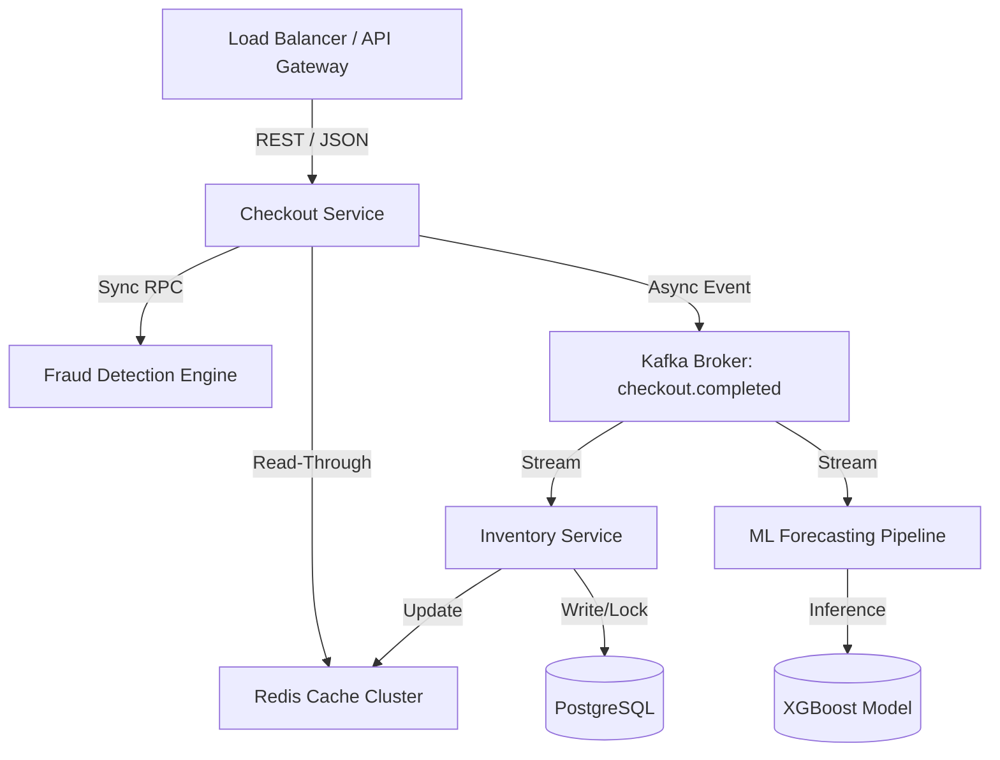

# System Architecture

## High-Level Distributed Architecture

StoreSync is engineered as a highly concurrent, distributed retail platform simulating large-scale traffic, inventory contention, and real-time inference. The architecture relies on an asynchronous, event-driven topology using Apache Kafka as the backbone, decoupling synchronous checkout orchestration from downstream inventory reconciliation and demand forecasting.

## Service Responsibilities

### Checkout Service (Orchestrator)
Acts as the synchronous entry point. Responsibilities include HTTP request termination, payload validation, interacting with the Fraud Detection Engine, fetching pre-computed pricing strategies, and emitting immutable domain events (`checkout.completed`) to Kafka. It favors high throughput and low latency, deliberately avoiding synchronous locking on inventory databases.

### Inventory Service
Consumes Kafka streams and acts as the system of record for SKU availability. Responsibilities include resolving concurrent modifications via Optimistic Concurrency Control (OCC), managing Redis cache invalidation, and ensuring strict exact-once reservation semantics.

### ML Forecasting Service
A FastAPI application consuming aggregated sales streams to execute batched predictions against a pre-trained XGBoost model. It writes predicted demand curves back to the operational datastore for use in supply chain reordering and anomaly detection.

## Synchronous vs Asynchronous Communication

StoreSync employs a hybrid communication model:
- **Synchronous (RPC/HTTP):** Used exclusively in the critical path of the Checkout Service to guarantee latency bounds for user-facing APIs (Fraud evaluation, API Gateway routing).
- **Asynchronous (Event-Driven):** Used for all downstream operations (Inventory deduction, Reorder calculations, ML inference). This ensures that a database bottleneck in the Inventory Service does not cause cascading timeouts in the Checkout Service.

## Optimistic Locking & Inventory Reservation

To prevent database deadlocks and minimize contention, StoreSync avoids pessimistic database locks. Instead, it utilizes `@Version` fields in PostgreSQL. When multiple threads attempt to reserve the same SKU concurrently, the first commit succeeds. Subsequent commits encounter an `OptimisticLockException` and fall back into an exponential backoff retry queue, maximizing throughput without sacrificing consistency.

## Caching Strategy
A read-through Redis architecture minimizes load on PostgreSQL. The Checkout Service queries Redis for available stock before initiating checkout. The Inventory Service handles cache invalidation post-commit to ensure eventual consistency. 

## Fault Tolerance & Scaling
- **Horizontal Scaling:** Services are stateless and horizontally scalable.
- **Circuit Breakers:** Implemented on synchronous downstream calls.
- **Dead Letter Queues (DLQ):** Unprocessable Kafka events are routed to a DLQ for manual inspection, ensuring the main topic partitions do not stall.
