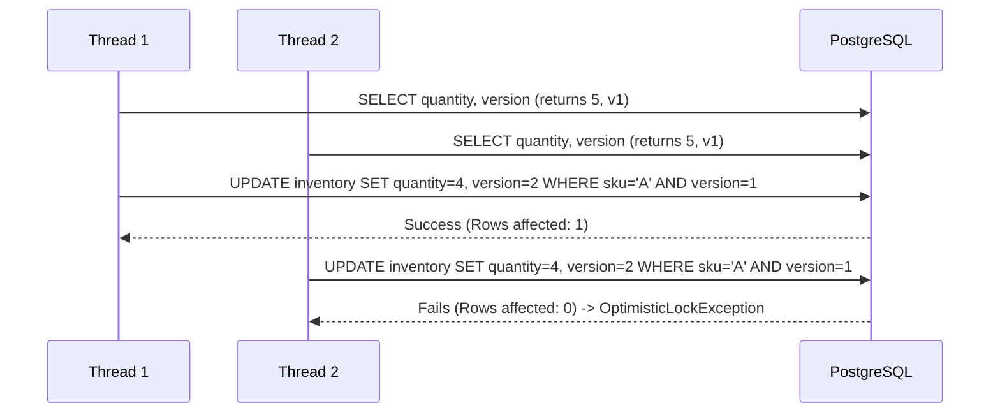

# Concurrency Control

Resolving inventory contention during high-velocity checkout scenarios (e.g., PS5 restock events) is a critical engineering challenge. StoreSync utilizes a dual-tier concurrency control strategy combining JVM-level synchronization with Database-level Optimistic Concurrency Control (OCC).

## The Contention Problem
In a distributed system, if 100 checkout requests simultaneously attempt to reserve the final unit of a specific SKU, traditional pessimistic database locking (e.g., `SELECT ... FOR UPDATE`) will serialize the threads, causing massive connection pool exhaustion, latency spikes, and eventual cascading failure.

## Dual-Tier Solution

### Tier 1: JVM-Level `ConcurrentHashMap` & `ReentrantLock`
Before hitting the database, the Inventory Service throttles access using in-memory locks mapped by SKU.

```java
private final ConcurrentHashMap<String, ReentrantLock> skuLocks = new ConcurrentHashMap<>();

public void reserve(String skuId, int quantity) {
    ReentrantLock lock = skuLocks.computeIfAbsent(skuId, k -> new ReentrantLock());
    if (lock.tryLock(500, TimeUnit.MILLISECONDS)) {
        try {
            // Proceed to Tier 2
        } finally {
            lock.unlock();
        }
    } else {
        throw new TemporaryLockTimeoutException("Contention too high, re-queue event");
    }
}
```
*Why?* This prevents 1,000 threads on the same pod from hammering the database simultaneously for the same row.

### Tier 2: Optimistic Locking (OCC) via JPA `@Version`
When the JVM thread attempts the database write, it relies on PostgreSQL row versioning.

```java
@Entity
public class StoreInventory {
    @Id private String skuId;
    private int availableQuantity;
    
    @Version
    private Long version;
}
```



## Failure Scenarios & Retry Logic
When an `ObjectOptimisticLockingFailureException` is thrown:
1. The transaction is immediately rolled back.
2. The consumer does NOT drop the event.
3. The event is pushed into an in-memory retry queue with Exponential Backoff + Jitter to prevent a thundering herd scenario.
4. If retries exhaust, the event is routed to the Dead Letter Queue (DLQ).

## Exact-Once Semantics
To prevent duplicate reservations in the event of network partition or Kafka at-least-once delivery, every checkout request includes an `idempotencyKey`. The system checks the transaction table (or Redis cache) for this key prior to executing the reservation workflow.
