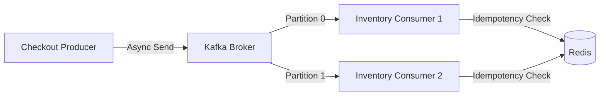

# Kafka Event Streaming Architecture

StoreSync leverages Apache Kafka as its central nervous system, ensuring decoupled, highly available, and scalable inter-service communication. By transitioning away from synchronous REST calls for critical state changes, the platform guarantees high throughput and fault tolerance under load.

## Topic Architecture

| Topic Name | Partition Key | Purpose | Retention |
|---|---|---|---|
| `checkout.completed` | `store_id` | Emitted when a checkout passes fraud/pricing. Consumed by Inventory and ML layers. | 7 Days |
| `inventory.updated` | `sku_id` | Emitted after successful OCC commit. Triggers Redis cache invalidation. | 24 Hours |
| `fraud.alerts` | `user_id` | Emitted when sliding window blocks a user. Triggers security workflows. | 30 Days |
| `checkout.dlq` | `transaction_id` | Dead Letter Queue for unprocessable checkout events. | Infinite |

## Producer/Consumer Semantics

### Throughput & Partitioning
Topics are partitioned logically (e.g., by `store_id` or `sku_id`). This ensures that all events for a specific store or SKU are routed to the same partition, guaranteeing strict chronological ordering for that entity and preventing race conditions in downstream consumers.

### Idempotent Consumption
Because Kafka guarantees at-least-once delivery, consumers must be idempotent.
- Consumers log the `transaction_id` in Redis (`SETNX`) prior to processing.
- If the consumer crashes post-processing but pre-offset-commit, the restart will re-read the message, but the Redis check will instantly skip execution, preventing duplicate inventory deductions.

## Consumer Lag & Dead Letter Queues (DLQ)

Monitoring Consumer Lag is critical. If lag spikes (e.g., during simulated Chaos Engineering broker failures):
1. **Backpressure:** The system does not drop events; they buffer in Kafka.
2. **DLQ Routing:** If an event consistently throws non-transient exceptions (e.g., malformed JSON payload), the consumer catches the error, ACKs the offset, and routes the raw payload to `checkout.dlq` to prevent poison-pill blocking on the partition.

## Eventual Consistency Tradeoffs

By utilizing Kafka, StoreSync accepts **Eventual Consistency**.
- When a user clicks "Checkout", the API responds `202 Accepted` immediately.
- The inventory is not strictly deducted at that exact millisecond.
- It will be deducted milliseconds later by the Inventory Service.
- *Tradeoff:* In rare edge cases, a user might purchase an item that goes out of stock in the intervening milliseconds. This requires a business-level compensatory transaction (e.g., automated refund email) rather than a rigid distributed system lock.
